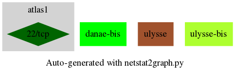
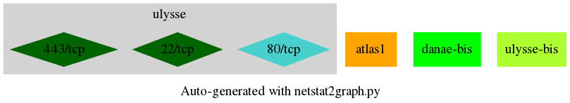
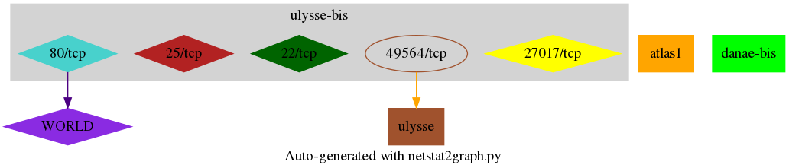

# netstat2graph tool
Draw graphs of all connections of a system of hosts based 
on log files obtained by running `ss -natpu -4` on each host.
For example give a list of hosts, the log could be gathered with the following command:  

`for dest in ulysse danae-bis atlas1 ulysse-bis; do ssh root@$dest "ss -natpu -4 " > logs/netstat-$dest.log ; done`  

NB: You may need root credentials to run **netstat** or **ss**.

It writes a csv gathering the whole platform connections.
It writes an image + a dot file for each host processed.
Nodes in diamond shapes represent LISTEN sockets.

Examples included in directory **examples**
[global-network](examples/platform-network.csv)
[atlas1-dot](examples/atlas1-network.dot)

